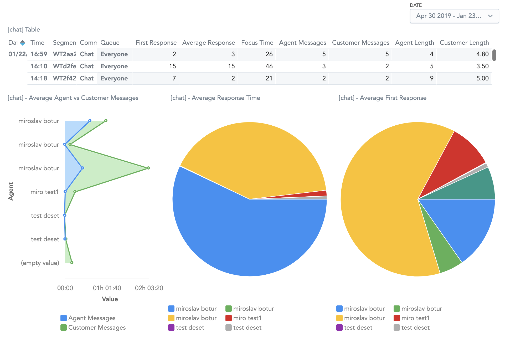

# Flex Focus Time with Chat Metrics



# Overview

Flex plugin to measure focus time and additional metrics for chat related channels. All metrics are sent via taskrouter to Flex Insights.

# Focus Time

Focus Time is a metric that measures time spent on each reservation. In a multi-tasking scenario where an Agent is working 
multiple interactions at the same time, this plugin will track the "in focus" time for each task instead of just the task duration. 
The logging stops as soon as the task enters the Wrapup state. Unlike in https://github.com/lehel-twilio/plugin-handleTimeTracker, this plugin uses
browser local storage, therefore, it's resilient against browser refreshes.


The focus time is calculated for all channels and, by default, the **focus_time** attribute is used and recommended for Flex Insights.
   
# Additional Chat Metrics

Together with the Focus Time, there are additional metrics that can be enabled for chat-like channels:

### First Response Time

* duration in seconds between a reservation is accepted and first message is sent by agent
* by default **first_response_time** atribute is used for Flex Insights

### Average Response Time

* average duration in seconds between customer message and agent's first following message
* first agent's message duration is excluded, because it would include queue time (customer sends first message > waiting in queue > agent accept reservation > first message sent)

### Number of Agent Messages

* number of messages sent by Agent

### Number of Customer Messages

* number messages sent by Customer
* if there is transfer or longlived channels configured then the function needs to be enhanced to exclude other agent(s) too

### Average Length of Agent's Messages

* average number of characters in agent's messages

### Average Length of Customer's Messages

* average number of characters in customer's messages
* if there is transfer or longlived channels configured then the function needs to be enhanced to exclude other agent(s) too

# Configuration

### Deploy the Twilio Serverless Service

1. Set the environment variables (.env) 
```
ACCOUNT_SID=
AUTH_TOKEN=
TWILIO_CHAT_SERVICE=
```

2. Deploy the serverless project using Twilio Cli:  
```
twilio serverless:deploy
```

### Configure and Deploy the Plugin

1. Set variables in /src/config.js
```
const FOCUSTIMEATTRIBUTE = 'focus_time' 

const RUNTIMEDOMAIN = "https://flex-insights-service-xxx-dev.twil.io" //configure domain for the serverless function

const CHANNELS = ['chat'] //list all channels for additional metrics (first response time, average response time ...)

const FEATURES = {
    firstAgentResponse : 'first_response_time',
    averageResponseTime: 'average_response_time',
    agentMessages: 'conversation_measure_2',
    customerMessages: 'conversation_measure_3',
    averageAgentLength: 'conversation_measure_4',
    averageCustomerLength: 'conversation_measure_6'
}
```

* see available Flex Insights metric attributes in [Twilio Documentation](https://www.twilio.com/docs/flex/developer/insights/enhance-integration#add-custom-attributes-and-measures) (metrics has number as the value)
* if you do not want to use any feature then configure value to 'null'
* an example of disabling features 

```const FEATURES = {
    firstAgentResponse : 'first_response_time',
    averageResponseTime: 'average_response_time',
    agentMessages: null,
    customerMessages: 'conversation_measure_3',
    averageAgentLength: null,
    averageCustomerLength: null
}
```
2. Deploy and Release the Plugin
